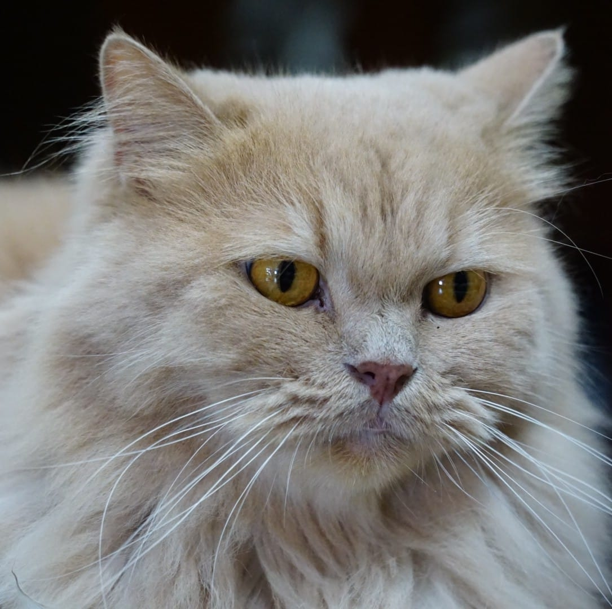
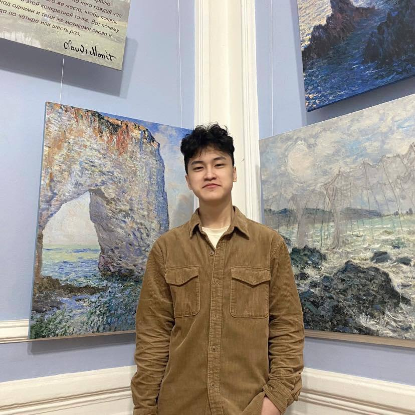
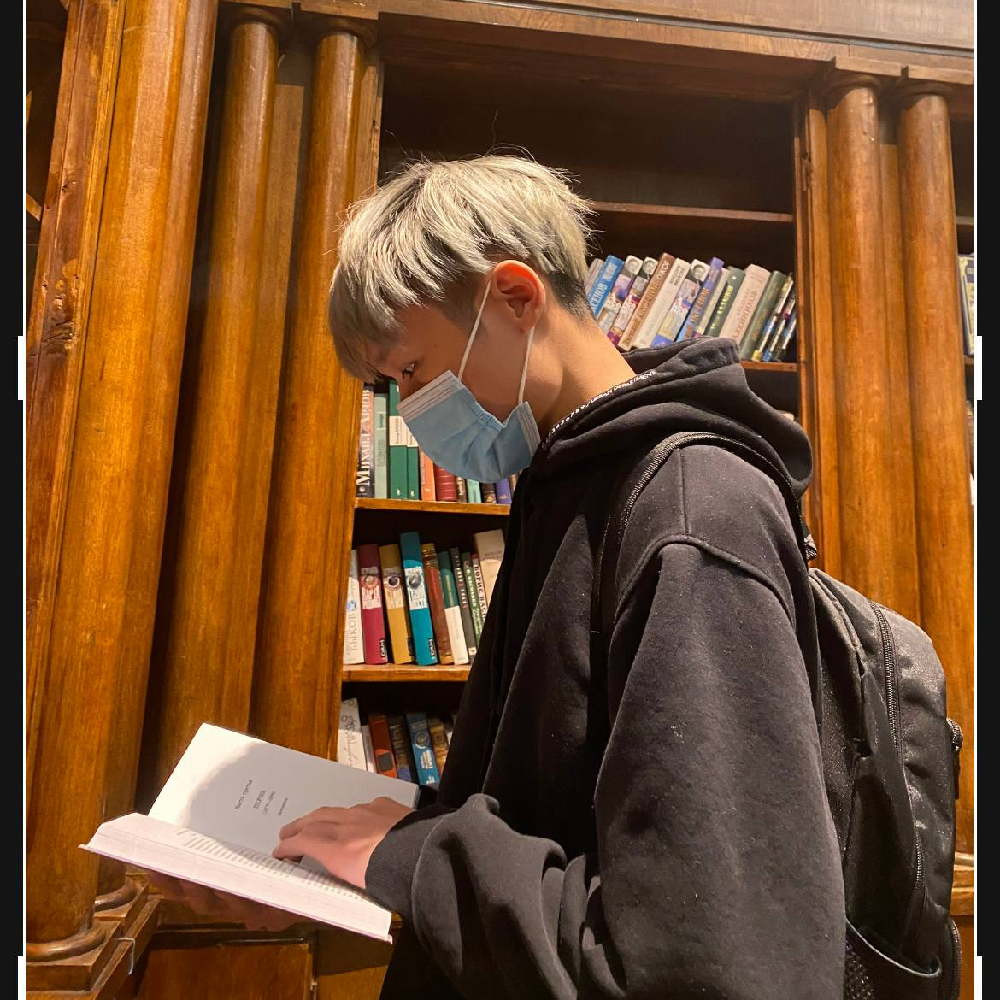

 

# 💀Team Members

 

## Active Members

| | |
| --------------------------------------------------------- | ------------------------------------------------------------|
|  | **Vietzettt** **(C)**  Studying Information Security In National Research University "MPEI"  Reverse Engineering  - Blog: [https://vietzettt.github.io](https://vietzettt.github.io/)  - Github: [vietzettt](https://github.com/vietzettt) |
|  | **Shang**  Studying Information Security In National Research University "MPEI"   Web Security  - Blog: [https://shangs.gitbook.io](https://shangs.gitbook.io/shang/) - Github: [Shang](https://github.com/shanglyu)                                           |
|  | **Dunglq2000**  Studying Information Security In National Research University "MPEI"   Cryptography  - Blog: [https://dunglq.gitbook.io](https://dunglq.gitbook.io/mathcrypto/) - Github: [dunglq2000](https://github.com/dunglq2000) |
|  | **Daphnia**    OSINT & Forensics   - Blog: [https://blog.daphnia.pw](https://blog.daphnia.pw/)  - Github: [swiss-kn9fe](https://github.com/swiss-kn9fe) |
|  | **LeoP**  Đang trên con đường tìm hiểu bản thân...   Miscellaneous  - Github: [kenzoku247](https://github.com/kenzoku247) |

 

## New Members

| | |
| --------------------------------------------------------- | ------------------------------------------------------------|
|  | **LQA**   Studying Information Security In ITMO university   Miscellaneous & Forensics  - Github: [LeQA](https://github.com/LeQA) |
|  | **Lyn**  Là một con người.  Web Security  - Blog: [https://lynngu2.wordpress.com](https://lynngu2.wordpress.com/) - Github: [52hzNKL](https://github.com/52hzNKL)|
|  | **KhanhCV**  Web Security  - Blog: [https://danoblog.ru](https://danoblog.ru) - Github: [KhanhCVHE](https://github.com/KhanhCVHE) |
|  | **misa0136**   National Research University ITMO   Web Security  - Blog: [https://misa0136.gitbook.io/blog](https://misa0136.gitbook.io/blog/) |
|  | **fox**   Web Security & Reverse Engineering  - Blog: [https://nhatanh2305.github.io/portfolio/](https://nhatanh2305.github.io/portfolio/)|
|  | **Helious**  Thất bại ở đâu mình đứng lên ở đó   Cryptography  - Blog: [https://helious12.github.io](https://helious12.github.io) - Github: [Helious12](https://github.com/Helious12) |
|  | **hoangtumeo97**    Studying Information Security In ITMO University, Saint Petersburg   Miscellaneous   -- Github: [hoang97](https://github.com/hoang97) |

 

<!-- ## Historical Active Members

| | |
| :----------------------------------------------------: | :---------------------------------------------------------- |

  -->

# 🏆Selected Awards

|                      Event Name                      |           Time            |
| ---------------------------------------------------- | ------------------------: |
| M☆CTF Trainning 2023 2th place | Online, Moscow, Russia, Feb.2023|
| MPEI CTF 2022 1th place | MPEI University, Moscow, Russia, July.2022 |

... more available at <a href="https://ctftime.org/team/197319">ctftime</a>.

 

# 📑Writeups

|                      Event Name                      |           Links            |
| ---------------------------------------------------- | ------------------------: |
|[M☆CTF Trainning 2023](https://mctf.mtuci.ru/) | [Web](https://shangs.gitbook.io/shang/write-up-ctf/ctf-competitions/m-ctf-training-2023) & [Reverse](https://vietzettt.ru/posts/2023/02/mctf_trainning_2023) |
|[LA CTF 2023](https://ctftime.org/event/1732) | [Reverse](https://vietzettt.ru/posts/2023/02/lactf_2023) |
|[DiceCTF 2023](https://ctftime.org/event/1838)| [Crypto](https://dunglq.gitbook.io/mathcrypto/ctf-re-writeups/dice-ctf-2023) & [Web](https://shangs.gitbook.io/shang/write-up-ctf/ctf-competitions/dice-ctf-2023-writeup-web) |
| [Byte Bandits CTF 2023](https://ctftime.org/event/1877) | [Reverse](https://vietzettt.ru/posts/2023/02/bbctf_2023) & [Web](https://shangs.gitbook.io/shang/write-up-ctf/ctf-competitions/bytebandits-ctf-2023-writeup-web) |
| [KnightCTF 2023](https://ctftime.org/event/1792) | [Reverse](https://vietzettt.ru/posts/2023/01/knightCTF_2023) & [Web](https://shangs.gitbook.io/shang/write-up-ctf/ctf-competitions/knight-ctf-2023-write-up-web) |
| [WRECKCTF 2022](https://ctftime.org/event/1775) | [Reverse](https://vietzettt.ru/posts/2022/10/wreckctf_2022) & [Web](https://shangs.gitbook.io/shang/write-up-ctf/ctf-competitions/wreck-ctf-2022-write-up-web) |
| [Cryptoverse CTF 2022](https://ctftime.org/event/1735) | [Reverse](https://vietzettt.ru/posts/2022/10/cryptoversectf_2022) |
| [Sekai CTF 2022](https://ctftime.org/event/1619) | [Crypto](https://dunglq.gitbook.io/mathcrypto/ctf-writeups/sekai-ctf-2022) & [Web](https://shangs.gitbook.io/shang/write-up-ctf/ctf-competitions/sekai-ctf-2022-write-up-web) |
| [DownUnder CTF 2022](https://ctftime.org/event/1625) | [Crypto](https://dunglq.gitbook.io/mathcrypto/ctf-writeups/downunder-ctf-2022) & [Reverse](https://vietzettt.ru/posts/2022/09/down_under_ctf_2022) |
